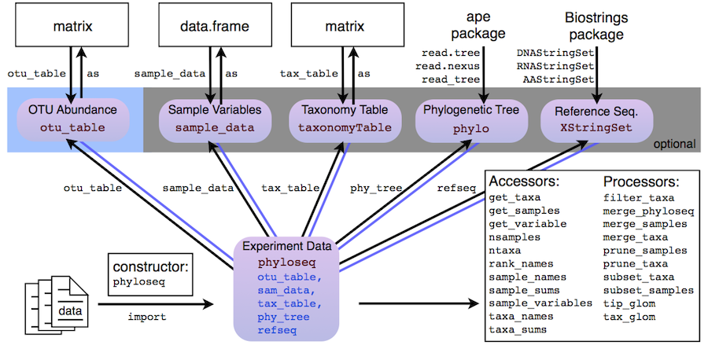

<!--
%% \VignetteEngine{knitr::rmarkdown}
%% \VignetteIndexEntry{phyloseq basics vignette}
-->

`r library("knitr")`
`r opts_chunk$set(cache=FALSE, fig.width=9, message=FALSE, warning=FALSE)`

Paul J. McMurdie and Susan Holmes

<mcmurdie@stanford.edu>

[phyloseq Home Page](http://joey711.github.io/phyloseq/)

If you find phyloseq and/or its tutorials useful, please acknowledge and cite phyloseq in your publications:

**phyloseq: An R package for reproducible interactive analysis and graphics of microbiome census data** (2013) PLoS ONE 8(4):e61217
http://dx.plos.org/10.1371/journal.pone.0061217

## Other resources
The phyloseq project also has a number of supporting online resources, most of which can by found at [the phyloseq home page](http://joey711.github.com/phyloseq/), or from the phyloseq stable release [page on Bioconductor](http://bioconductor.org/packages/release/bioc/html/phyloseq.html).

To post feature requests or ask for help, try [the phyloseq Issue Tracker](https://github.com/joey711/phyloseq/issues).


# Introduction

The analysis of microbiological communities brings many challenges: the integration of many different types of data with methods from ecology, genetics, phylogenetics, network analysis, visualization and testing. The data itself may originate from widely different sources, such as the microbiomes of humans, soils, surface and ocean waters, wastewater treatment plants, industrial facilities, and so on; and as a result, these varied sample types may have very different forms and scales of related data that is extremely dependent upon the experiment and its question(s). The phyloseq package is a tool to import, store, analyze, and graphically display complex phylogenetic sequencing data that has already been clustered into Operational Taxonomic Units (OTUs), especially when there is associated sample data, phylogenetic tree, and/or taxonomic assignment of the OTUs. This package leverages many of the tools available in R for ecology and phylogenetic analysis (vegan, ade4, ape, picante), while also using advanced/flexible graphic systems (ggplot2) to easily produce publication-quality graphics of complex phylogenetic data. phyloseq uses a specialized system of S4 classes to store all related phylogenetic sequencing data as single experiment-level object, making it easier to share data and reproduce analyses. In general, phyloseq seeks to facilitate the use of R for efficient interactive and reproducible analysis of OTU-clustered high-throughput phylogenetic sequencing data.


# About this vignette

## Typesetting Legend <a id="sec:typeset-legend"></a>

- **bold** - Bold is used for emphasis.
- *italics* - Italics are used for package names, and special words, phrases.
- `code font` - The font for code, usually courrier-like,
but depends on the theme.
- `myFun()` - Code font word with `()` attached at the right-end,
is a function name.
- [Hyperlink](#sec:typeset-legend) - Hyperlinks are
clickable text that will jump to sections and external pages.

## Other links and tutorials

An overview of phyloseq's intended functionality, goals, and design is provided
in the following free and open access article:

McMurdie and Holmes (2013). [phyloseq: An R package for reproducible interactive analysis and graphics of microbiome census data](http://dx.plos.org/10.1371/journal.pone.0061217). PLoS ONE e61217.

The most updated examples are posted in our online tutorials from
[the phyloseq home page](http://joey711.github.com/phyloseq)

A separate vignette describes analysis tools included in phyloseq along with various examples using included example data. A quick way to load it is:

```{r, eval=FALSE}
vignette("phyloseq_analysis")
```

By contrast, this vignette is intended to provide functional examples of the basic data import and manipulation infrastructure included in phyloseq. This includes example code for importing OTU-clustered data from different clustering pipelines, as well as performing clear and reproducible filtering tasks that can be altered later and checked for robustness. The motivation for including tools like this in phyloseq is to save time, and also to build-in a structure that requires consistency across related data tables from the same experiment.This not only reduces code repetition, but also decreases the likelihood of mistakes during data filtering and analysis. For example, it is intentionally difficult in phyloseq to create an experiment-level object in which a component tree and OTU table have different OTU names. The import functions, trimming tools, as well as the main tool for creating an experiment-level object, `phyloseq`, all automatically trim the OTUs and samples indices to their intersection, such that these component data types are exactly coherent.


# phyloseq classes <a id="sec:app-classes"></a>

The class structure in the *phyloseq* package follows the inheritance diagram shown in the figure below.
Currently, *phyloseq* uses 4 core data classes.
They are 
(1) the OTU abundance table (`otu_table`), 
a table of sample data (`sample_data`); 
(2) a table of taxonomic descriptors (`taxonomyTable`); and
(3) a phylogenetic tree (`"phylo"`-class, [ape package](http://cran.r-project.org/web/packages/ape/).

The `otu_table` class can be considered the central data type, 
as it directly represents the number and type of sequences observed in each sample. 
`otu_table` extends the numeric matrix class in the `R` base, 
and has a few additonal feature slots. 
The most important of these feature slots is the `taxa_are_rows` slot, 
which holds a single logical that indicates whether the table is oriented 
with taxa as rows (as in the *genefilter* package in [Bioconductor](#cite:bioconductor)
or with taxa as columns (as in *vegan* and *picante* packages). 
In *phyloseq* methods, as well as its extensions of methods in other packages, 
the `taxa_are_rows` value is checked to ensure proper orientation of the `otu_table`. 
A *phyloseq* user is only required to specify the `otu_table` orientation during initialization, following which all handling is internal. 

The `sample_data` class directly inherits `R`'s `data.frame` class, and thus effectively stores both categorical and numerical data about each sample. The orientation of a `data.frame` in this context requires that samples/trials are rows, and variables are columns (consistent with *vegan* and other packages). The `taxonomyTable` class directly inherits the `matrix` class, and is oriented such that rows are taxa/OTUs and columns are taxonomic levels (e.g. *Phylum*). 

The phyloseq-class can be considered an "experiment-level class" and should contain two or more of the previously-described core data classes. We assume that *phyloseq* users will be interested in analyses that utilize their abundance counts derived from the phylogenetic sequencing data, and so the `phyloseq()` constructor will stop with an error if the arguments do not include an `otu_table`. There are a number of common methods that require either an `otu_table` and `sample_data` combination, or an `otu_table` and phylogenetic tree combination. These methods can operate on instances of the phyloseq-class, and will stop with an error if the required component data is missing.


 Classes and inheritance in the *phyloseq* package. The class name and its slots are shown with red- or blue-shaded text, respectively. Coercibility is indicated graphically by arrows with the coercion function shown. Lines without arrows indicate that the more complex class (``phyloseq") contains a slot with the associated data class as its components.


# Load *phyloseq* and import data <a id="sec:load"></a>

Now let's get started by loading phyloseq, and describing some methods for importing data.

## Load *phyloseq*

To use *phyloseq* in a new R session, it will have to be loaded. This can be done in your package manager, or at the command line using the `library()` command:
```{r load-packages, message=FALSE, warning=FALSE}
library("phyloseq")
```

## Import data

An important feature of *phyloseq* are methods 
for importing phylogenetic sequencing data 
from common taxonomic clustering pipelines. 
These methods take file pathnames as input, 
read and parse those files, 
and return a single object that contains all of the data. 

Some additional background details are provided below. 
The best reproducible examples on importing data with phyloseq 
can be found on the official data import tutorial page:

http://joey711.github.com/phyloseq/import-data


## Import from biom-format <a id="sec:biom"></a>

New versions of QIIME (see below) produce a file in *version 2* of the
[biom file format](http://biom-format.org/),
which is a specialized definition of the HDF5 format.

The phyloseq package provides the `import_biom()` function,
which can import both 
*Version 1* (JSON) and 
*Version 2* (HDF5)
of the BIOM file format. 

The *phyloseq* package fully supports 
both taxa and sample observations of the biom format standard,
and works with the BIOM files output from QIIME, RDP, MG-RAST, etc.


## Import from QIIME (Modern)<a id="sec:qiimeimport"></a>

The default output from modern versions of QIIME 
is a BIOM-format file (among others).
This is suppored in phyloseq.

### Sample data from QIIME

Sometimes inaccurately referred to as *metadata*,
additional observations on samples provided as *mapping file* to QIIME
have not typically been output in the BIOM files,
**even though BIOM format supports it**.
This failure to support the full capability of the BIOM format
means that you'll have to provide sample observations as a separate file.
There are many ways to do this, but the QIIME sample map is supported.

### Input

Two QIIME output files (`.biom`, `.tre`) 
are recognized by the `import_biom()` function.
One QIIME input file (sample map, tab-delimited),
is recognized by the `import_qiime_sample_data()` function.

---
 Input File(s) | phyloseq function | Output
 --- | --- | ---
 `.biom`, `.tre`  | `import_biom()`  |  phyloseq object with OTU table, taxonomy table, and tree (if provided)
 `.tre`  |  `read_tree()` |  `phylo` object, representing phylogenetic tree.
 `map.txt` |  `import_qiime_sample_data()` |  A `sample_data` object
---

The objects created by each of the import functions above 
should be merged using `merge_phyloseq` to create one coordinated, self-consistent object.

### Output

- **Before Merging** - Before merging with `merge_phyloseq`, the output from these import activities is the three separate objects listed in the previous table.
- **After Merging** - After merging you have a single self-consistent phyloseq object
that contains an OTU table, taxonomy table, sample-data, and a phylogenetic tree.

### QIIME Example Tutorial

QIIME's "Moving Pictures" example tutorial output is a little too large 
to include within the phyloseq package 
(and thus is not directly included in this vignette).
However, the phyloseq home page includes
a full reproducible example of the import procedure described above:

**Link HERE**

For reference, or if you want to try yourself, 
the following is the relative paths within the QIIME tutorial directory
for each of the files you will need.

- BIOM file, originally at:
`r "moving_pictures_tutorial-1.9.0/illumina/precomputed-output/otus/otu_table_mc2_w_tax_no_pynast_failures.biom"`
- Tree file, originally at:
`r "moving_pictures_tutorial-1.9.0/illumina/precomputed-output/otus/rep_set.tre"`
- Map File, originally at:
`r "moving_pictures_tutorial-1.9.0/illumina/map.tsv"`


## Import from QIIME Legacy<a id="sec:qiimeimportleg"></a>

[QIIME](#cite:QIIME) is a free, open-source OTU clustering and analysis pipeline written for Unix (mostly Linux). It is distributed in a number of different forms (including a pre-installed virtual machine). See [the QIIME home page](http://qiime.org/) for details.

### Input

One QIIME input file (sample map), and two QIIME output files (`otu_table.txt`, `.tre`) are recognized by the `import_qiime()` function. Only one of the three input files is required to run, although an `"otu_table.txt"` file is required if `import_qiime()` is to return a complete experiment object.

In practice, you will have to find the relevant QIIME files among a number of other files created by the QIIME pipeline. A screenshot of the directory structure created during a typical QIIME run is shown in [the QIIME Directory Figure](#fig:qiimedirectory).


<a id="fig:qiimedirectory"></a>

 A typical QIIME output directory. The two output files suitable for import by *phyloseq* are highlighted. A third file describing the samples, their barcodes and covariates, is created by the user and required as *input* to QIIME. It is a good idea to import this file, as it can be converted directly to a `sample_data` object and can be extremely useful for certain analyses.


### Output

The class of the object returned by `import_qiime()` depends upon which filenames are provided. The most comprehensive class is chosen automatically, based on the input files listed as arguments. At least one argument needs to be provided.


## Import from mothur <a id="sec:mothurimport"></a>

The open-source, platform-independent, locally-installed software package, [mothur](#cite:Schloss:2009do), can also process barcoded amplicon sequences and perform OTU-clustering. It is extensively documented on [the mothur wiki](http://www.mothur.org/wiki/)

### Input

Currently, there are three different files produced by the *mothur* package (Ver `1.22+`) that can be imported by *phyloseq*. At minimum, a user must supply a "`.list`" file, and at least one of the following two files: `.groups` or `.tree`. The group file is produced by *mothur*'s `make.group()` function. Details can be found at [its wiki page](http://www.mothur.org/wiki/Make.group). The tree file is a phylogenetic tree calculated by *mothur*.

### Output

The output from `import_mothur()` depends on which file types are provided. If all three file types are provided, an instance of the phyloseq-class is returned that contains both an OTU abundance table and its associated phylogenetic tree.


## Import from PyroTagger

PyroTagger is an OTU-clustering pipeline for barcoded 16S rRNA amplicon sequences, served and maintained by the Department of Energy's (DOE's) Joint Genome Institute (JGI). It can be used through a straightforward web interface at [the PyroTagger home page](http://pyrotagger.jgi-psf.org/)

PyroTagger takes as input the untrimmed sequence (`.fasta`) and sequence-quality (`.qual`) files, as well as a sample mapping file that contains the bar code sequence for each sample and its name. It uses a 97\% identity threshold for defining OTU clusters (approximately species-level of taxonomic distinction), and provides no options for specifying otherwise. It does allow users to modify the threshold setting for low-quality bases.

### Input

PyroTagger returns a single excel spreadsheet file (`.xls`) containing both abundance and taxonomy data, as well as some associated confidence information related to each taxonomic assignment. This spreadsheet also reports on potential chimeric sequences. This single output file is sufficient for `import_RDP_tab()`, provided the file has been converted to a tab-delimited plain-text format. Any spreadsheet application should suffice. No other changes should be made to the `.xls` file.

### Output

`import_RDP_tab()` returns an instance of the phyloseq-class that contains the OTU abundance table and taxonomy table. To my knowledge, PyroTagger does not calculate a tree of the representative sequences from each OTU cluster, nor a distance object, so analyses like `tip_glom()` and `UniFrac` are not applicable.


## Import from RDP pipeline

The Ribosomal Database Project ([RDP](http://rdp.cme.msu.edu/)) provides a web-based barcoded 16S rRNA amplicon sequence processing pipeline called the [RDP Pyrosequencing Pipeline](http://pyro.cme.msu.edu/). A user must run all three of the "Data Processing" steps sequentially through the web interface in order to acquire the output from Complete Linkage Clustering, the approach to OTU clustering used by the RDP Pipeline. Note that this import function assumes that the sequence names in the resulting cluster file follow a particular naming convention with underscore delimiter (see below).

### Input

The output from the Complete Linkage Clustering, `.clust`, is the only input to the RDP pipeline importer:

```{r, eval=FALSE}
myOTU1 <- import_RDP_cluster("path/to/my/filename.clust")
```

### Output

This importer returns an `otu_table` object.

### Expected Naming Convention

The RDP cluster pipeline (specifically, the output of the complete linkage clustering step) has no formal documentation for the ".clust" file structure or its apparent sequence naming convention.

The cluster file itself contains the names of all sequences contained in the input alignment. If the upstream barcode and aligment processing steps are also done with the RDP pipeline, then the sequence names follow a predictable naming convention wherein each sequence is named by its sample and sequence ID, separated by a `"_"` as delimiter:

`sampleName_sequenceIDnumber`

This import function assumes that the sequence names in the cluster file follow this convention, and that the sample name does not contain any `"_"`. It is unlikely to work if this is not the case. It is likely to work if you used the upstream steps in the RDP pipeline to process your raw (barcoded, untrimmed) fasta/fastq data.


## Example Data (included)

There are multiple example data sets included in *phyloseq*. Many are from published investigations and include documentation with a summary and references, as well as some example code representing some aspect of analysis available in *phyloseq*. In the package index, go to the names beginning with "data-" to see the documentation of currently available example datasets.

To load example data into the working environment, use the `data()` command:

```{r, eval=FALSE}
data(GlobalPatterns)
data(esophagus)
data(enterotype)
data(soilrep) 
```

Similarly, entering `?enterotype` will reveal the documentation for the so-called "enterotype" dataset. For details examples, see [the Example Data tutorial](http://joey711.github.io/phyloseq/Example-Data.html)

## phyloseq Object Summaries

In small font, the following is the summary of the `GlobalPatterns` dataset that prints to the terminal. These summaries are consistent among all `phyloseq-class` objects. Although the components of `GlobalPatterns` have many thousands of elements, the command-line returns only a short summary of each component. This encourages you to check that an object is still what you expect, without needing to let thousands of elements scroll across the terminal. In the cases in which you do want to see more of a particular component, use an accessor function (see table below).


```{r}
data(GlobalPatterns)
GlobalPatterns
```


## Convert raw data to phyloseq components

Suppose you have already imported raw data from an experiment into `R`, and their indices are labeled correctly. How do you get *phyloseq* to recognize these tables as the appropriate class of data? And further combine them together? Table [Table of Component Constructor Functions](#table:build) lists key functions for converting these core data formats into specific component data objects recognized by *phyloseq*. These will also

 Table of component constructor functions for building component data objects <a id="table:build"></a>

---
 Function |  Input Class |  Output Description
 --- | --- | ---
 `otu_table`  |  numeric matrix  |  `otu_table` object storing OTU abundance 
 `otu_table`  |  data.frame |  `otu_table` object storing OTU abundance 
 `sample_data` |  data.frame |  `sample_data` object storing sample variables 
 `tax_table`  |  character matrix  |  `taxonomyTable` object storing taxonomic identities 
 `tax_table`  |  data.frame  |  `taxonomyTable` object storing taxonomic identities 
 `read_tree` |  file path char  |  phylo-class tree, read from file 
 `read.table` |  table file path |  A matrix or data.frame (Std `R` core function) 
---

 phyloseq constructors: functions for building/merging *phyloseq* objects.

---
Function | Input Class | Output Description
--- | --- | ---
`phyloseq` | Two or more component objects | phyloseq-class, *experiment-level* object
`merge_phyloseq`| Two or more component or phyloseq-class objects | Combined instance of phyloseq-class
---

The following example illustrates using the constructor methods for component data tables. 

```{r, eval=FALSE}
otu1 <- otu_table(raw_abundance_matrix, taxa_are_rows=FALSE)
sam1 <- sample_data(raw_sample_data.frame) 
tax1 <- tax_table(raw_taxonomy_matrix)
tre1 <- read_tree(my_tree_file)
```

## phyloseq() function: building complex phyloseq objects

Once you've converted the data tables to their appropriate class, combining them into one object requires only one additional function call, `phyloseq()`:
```{r, eval=FALSE}
ex1b <- phyloseq(my_otu_table, my_sample_data, my_taxonomyTable, my_tree)
```

You do not need to have all four data types in the example above in order to combine them into one validity-checked experiment-level phyloseq-class object. The `phyloseq()` method will detect which component data classes are present, and build accordingly. Downstream analysis methods will access the required components using *phyloseq*'s accessors, and throw an error if something is missing. For most downstream methods you will only need to supply the combined, phyloseq-class object (the output of `phyloseq()` ), usually as the first argument. 
```{r, eval=FALSE}
ex1c <- phyloseq(my_otu_table, my_sample_data)
```

Whenever an instance of the phyloseq-class is created by *phyloseq* --- for example, when we use the `import_qiime()` function to import data, or combine manually imported tables using `phyloseq()` --- the row and column indices representing taxa or samples are internally checked/trimmed for compatibility, such that all component data describe exactly (and only) the same OTUs and samples.

## Merge

The phyloseq project includes support for two complete different categories of merging.

  - Merging the OTUs or samples in a phyloseq object, based upon a taxonomic or sample variable: `merge_samples()`, `merge_taxa()`
  - Merging two or more data objects that come from the same experiment, so that their data becomes part of the same phyloseq object: `merge_phyloseq()`

For further details, see the reproducible online tutorial at:

http://joey711.github.com/phyloseq/merge


# Accessor functions <a id="sec:accessors"></a>

Once you have a phyloseq object available, many accessor functions are available to query aspects of the data set. The function name and its purpose are summarized in [the Accessor Functions Table](#table:access).

 Accessor functions for *phyloseq* objects.

<a id="table:access"></a>

---
Function | Returns
--- | ---
 `[`  |  Standard extraction operator. Works on `otu_table`, `sample_data`, and `taxonomyTable`
 `access`  |  General slot accessor function for phyloseq-package 
 `get_taxa` |  Abundance values of all taxa in sample `i' 
 `get_sample` |  Abundance values of taxa `i' for all samples 
 `get_taxa_unique` |  A unique vector of the observed taxa at a particular taxonomic rank 
 `get_variable`  |  An individual sample variable vector/factor 
 `nsamples`  |  Get the number of samples described by an object 
 `ntaxa`  |  Get the number of OTUs (taxa) described by an object 
 `otu_table` | Build or access otu_table objects 
 `rank_names` |  Get the names of the available taxonomic ranks 
 `sample_data` |  Build or access `sample_data` objects 
 `sample_names` |  The names of all samples 
 `taxa_names`  |  The names of all taxa 
 `sample_sums` |  The sum of the abundance values of each sample 
 `sample_variables`  |  The names of sample variables 
 `taxa_sums`  |  The sum of the abundance values of each taxa 
 `taxa_are_rows` |  `TRUE` if taxa are row indices in `otu_table` 
 `tax_table`  |  A taxonomy table
 `phy_tree` |  Access the tree contained in a phyloseq object
---


# Trimming, subsetting, filtering phyloseq data <a id="sec:trim"></a>

## Trimming: prune_taxa()
Trimming high-throughput phylogenetic sequencing data can be useful, or even necessary, for certain types of analyses. However, it is important that the original data always be available for reference and reproducibility; and that the methods used for trimming be transparent to others, so they can perform the same trimming or filtering steps on the same or related data. To facilitate this, *phyloseq* contains many ways to trim/filter the data from a phylogenetic sequencing project. Because matching indices for taxa and samples is strictly enforced, subsetting one of the data components automatically subsets the corresponding indices from the others. Variables holding trimmed versions of your original data can be declared, and further trimmed, without losing track of the original data.

In general, most trimming should be accomplished using the S4 methods `prune_taxa()` or `prune_samples()`.

## Simple filtering example

```{r echo=FALSE}
topN <- 20
```

For example, lets make a new object that only holds the most abundant `r topN` taxa in the experiment. To accomplish this, we will use the `prune_taxa()` function.

```{r}
data(GlobalPatterns)
most_abundant_taxa <- sort(taxa_sums(GlobalPatterns), TRUE)[1:topN]
ex2 <- prune_taxa(names(most_abundant_taxa), GlobalPatterns)
```

Now we can ask the question, "what taxonomic Family are these OTUs?" (Subsetting still returns a `taxonomyTable` object, which is summarized. We will need to convert to a vector)

```{r}
topFamilies <- tax_table(ex2)[, "Family"]
as(topFamilies, "vector")
```

## Arbitrarily complex abundance filtering

The previous example was a relatively simple filtering in which we kept only the most abundant `r topN` in the whole experiment. But what if we wanted to keep the most abundant `r topN` taxa of each sample? And of those, keep only the taxa that are also found in at least one-third of our samples? What if we wanted to keep only those taxa that met some across-sample criteria?

### genefilter_sample(): Filter by Within-Sample Criteria

For this more complicated filtering *phyloseq* contains a function, `genefilter_sample`, that takes as an argument a *phyloseq* object, as well as a list of one or more filtering functions that will be applied to each sample in the abundance matrix (`otu_table`), as well as an integer argument, `A`, that specifies for how many samples the filtering function must return `TRUE` for a particular taxa to avoid removal from the object. A supporting function `filterfun_sample` is also included in *phyloseq* to facilitate creating a properly formatted function (enclosure) if more than one function is going to be applied simultaneously. `genefilter_sample` returns a logical vector suitable for sending directly to `prune_taxa` for the actual trimming.

Here is an example on a completely fabricated `otu_table` called `testOTU`.
```{r, eval=FALSE}
testOTU <- otu_table(matrix(sample(1:50, 25, replace=TRUE), 5, 5), taxa_are_rows=FALSE)
f1<- filterfun_sample(topk(2))
wh1 <- genefilter_sample(testOTU, f1, A=2)
wh2 <- c(T, T, T, F, F)
prune_taxa(wh1, testOTU)
prune_taxa(wh2, testOTU)
```

Here is a second example using the included dataset, `GlobalPatterns`. The most abundant taxa are kept only if they are in the most abundant 10\% of taxa in at least half of the samples in dataset `GlobalPatterns`. Note that it is not necessary to subset `GlobalPatterns` in order to do this filtering. The S4 method `prune_taxa` subsets each of the relavent component objects, and returns the complex object back.

```{r}
data(GlobalPatterns)
f1<- filterfun_sample(topp(0.1))
wh1 <- genefilter_sample(GlobalPatterns, f1, A=(1/2*nsamples(GlobalPatterns)))
sum(wh1)
ex2 <- prune_taxa(wh1, GlobalPatterns)
```

```{r}
print(ex2)
```

If instead of the most abundant fraction of taxa, you are interested in the most abundant fraction of individuals (aka sequences, observations), then the `topf` function is appropriate. For steep rank-abundance curves, `topf` will seem to be much more conservative (trim more taxa) because it is based on the cumulative sum of relative abundance. It does not guarantee that a certain number or fraction of total taxa (richness) will be retained.

```{r, eval=FALSE}
data(GlobalPatterns)
f1<- filterfun_sample(topf(0.9))
wh1 <- genefilter_sample(GlobalPatterns, f1, A=(1/3*nsamples(GlobalPatterns)))
sum(wh1)
prune_taxa(wh1, GlobalPatterns)
```

### filter_taxa(): Filter by Across-Sample Criteria

The `filter_taxa` function is directly analogous to the `genefilter` function for microarray filtering, but is used for filtering OTUs from phyloseq objects. It applies an arbitrary set of functions -- as a function list, for instance, created by `genefilter::filterfun` -- as across-sample criteria, one OTU at a time. It can be thought of as an extension of the genefilter-package (from the Bioconductor repository) for phyloseq objects. It takes as input a phyloseq object, and returns a logical vector indicating whether or not each OTU passed the criteria. Alternatively, if the `prune` option is set to `r FALSE`, it returns the already-trimmed version of the phyloseq object.

Inspect the following example. Note that the functions `genefilter` and `kOverA` are from the genefilter package.

```{r}
data("enterotype")
library("genefilter")
flist<- filterfun(kOverA(5, 2e-05))
ent.logi <- filter_taxa(enterotype, flist)
ent.trim <- filter_taxa(enterotype, flist, TRUE)
identical(ent.trim, prune_taxa(ent.logi, enterotype)) 
identical(sum(ent.logi), ntaxa(ent.trim))
filter_taxa(enterotype, flist, TRUE)
```

## subset_samples(): Subset by Sample Variables

It is possible to subset the samples in a *phyloseq* object based on the sample variables using the `subset_samples()` function. For example to subset `GlobalPatterns` such that only certain environments are retained, the following line is needed (the related tables are subsetted automatically as well):

```{r}
ex3 <- subset_samples(GlobalPatterns, SampleType%in%c("Freshwater", "Ocean", "Freshwater (creek)"))
ex3
```

For this example only a categorical variable is shown, but in principle a continuous variable could be specified and a logical expression provided just as for the `subset` function. In fact, because `sample_data` component objects are an extension of the data.frame class, they can also be subsetted with the `subset` function:

```{r}
subset(sample_data(GlobalPatterns), SampleType%in%c("Freshwater", "Ocean", "Freshwater (creek)"))
```

## subset_taxa(): subset by taxonomic categories

It is possible to subset by specific taxonomic category using the `subset_taxa()` function. For example, if we wanted to subset `GlobalPatterns` so that it only contains data regarding the phylum *Firmicutes*:

```{r}
ex4 <- subset_taxa(GlobalPatterns, Phylum=="Firmicutes")
ex4
```

## random subsample abundance data

Can also randomly subset, for example a random subset of 100 taxa from the full dataset.

```{r}
randomSpecies100 <- sample(taxa_names(GlobalPatterns), 100, replace=FALSE)
ex5 <- prune_taxa(randomSpecies100, GlobalPatterns)
```


# Transform abundance data<a id="sec:transform"></a>

Sample-wise transformation can be achieved with the `transform_sample_counts()` function. It requires two arguments, (1) the *phyloseq* object that you want to transform, and the function that you want to use to perform the transformation. Any arbitrary function can be provided as the second argument, as long as it returns a numeric vector with the same length as its input. In the following trivial example, we create a second object, `ex2`, that has been "transformed" by the identity function such that it is actually identical to `GlobalPatterns`.

```{r, eval=FALSE}
data(GlobalPatterns)
ex2 <- transform_sample_counts(GlobalPatterns, I)
```

For certain kinds of analyis we may want to transform the abundance data. For example, for RDA we want to transform abundance counts to within-sample ranks, and to further include a threshold beyond which all taxa receive the same rank value. The ranking for each sample is performed independently, so that the rank of a particular taxa within a particular sample is not influenced by that sample's total quantity of sequencing relative to the other samples in the project. 

The following example shows how to perform such a thresholded-rank transformation of the abundance table in the complex *phyloseq* object `GlobalPatterns` with an arbitrary threshold of 500.

```{r}
ex4<- transform_sample_counts(GlobalPatterns, threshrankfun(500))
```


# Phylogenetic smoothing <a id="sec:glom"></a>

## tax_glom() 

Suppose we are skeptical about the importance of OTU-level distinctions in our dataset. For this scenario, *phyloseq* includes a taxonomic-agglommeration method,`tax_glom()`, which merges taxa of the same taxonomic category for a user-specified taxonomic level. In the following code, we merge all taxa of the same Genus, and store that new object as `ex6`.

```{r, eval=FALSE}
ex6 <- tax_glom(GlobalPatterns, taxlevel="Genus")
```

## tip_glom() 

Similarly, our original example object (`GlobalPatterns`) also contains a phlyogenetic tree corresponding to each OTU, which we could also use as a means to merge taxa in our dataset that are closely related. In this case, we specify a threshold patristic distance. Taxa more closely related than this threshold are merged. This is especially useful when a dataset has many taxa that lack a taxonomic assignment at the level you want to investigate, a problem when using `tax_glom()`. Note that for datasets with a large number of taxa, `tax_glom` will be noticeably faster than `tip_glom`. Also, keep in mind that `tip_glom` requires that its first argument be an object that contains a tree, while `tax_glom` instead requires a `taxonomyTable` (See [phyloseq classes](#sec:app-classes)).

```{r, eval=FALSE}
ex7 <- tip_glom(GlobalPatterns, speciationMinLength = 0.05)
```

Command output not provided here to save time during compilation of the vignette. The user is encouraged to try this out on your dataset, or even this example, if interested. It may take a while to run on the full, untrimmed data.


# Installation

## Installation

Please check [the phyloseq installation tutorial](http://joey711.github.com/phyloseq/install) for help with installation. This is likely to be the first place news and updated information about installation will be posted, as well. Also check out the rest of [the phyloseq homepage on GitHub](http://joey711.github.io/phyloseq/), as this is the best place to post issues, bug reports, feature requests, contribute code, etc.

## Installing Parallel Backend

For running parallel implementation of functions/methods in *phyloseq* (e.g. `UniFrac(GlobalPatterns, parallel=TRUE)`), you will need also to install a function for registering a parallel "backend". Only one working parallel backend is needed, but there are several options, and the best one will depend on the details of your particular system. The "doParallel" package is a good place to start. Any one of the following lines from an `R` session will install a backend package.

```{r, eval=FALSE}
install.packages("doParallel")
install.packages("doMC")
install.packages("doSNOW")
install.packages("doMPI")
```


# References

<a id="cite:bioconductor"></a>
Robert C Gentleman, Vincent J. Carey, Douglas M. Bates, et al. **Bioconductor: Open software development for computational biology and bioinformatics.** *Genome Biology* 5:R80, 2004.

<a id="cite:QIIME"></a>
J Gregory Caporaso, Justin Kuczynski, Jesse Stombaugh, Kyle Bittinger, Frederic D Bushman **QIIME allows analysis of high-throughput community sequencing data.** *Nature Methods* 7(5):335-336, 2010.

<a id="cite:Schloss:2009do"></a>
P D Schloss, S L Westcott, T Ryabin, J R Hall, M Hartmann, et al. **Introducing mothur: Open-Source, Platform-Independent, Community-Supported Software for Describing and Comparing Microbial Communities.** *Applied and Environmental Microbiology* 75(23):7537-7541, 2009.

<a id="cite:RDP"></a>
J R Cole, Q Wang, E Cardenas, J Fish, B Chai et al. **The Ribosomal Database Project: improved alignments and new tools for rRNA analysis.** *Nucleic Acids Research* 37(Database issue):D141-5, 2009.
